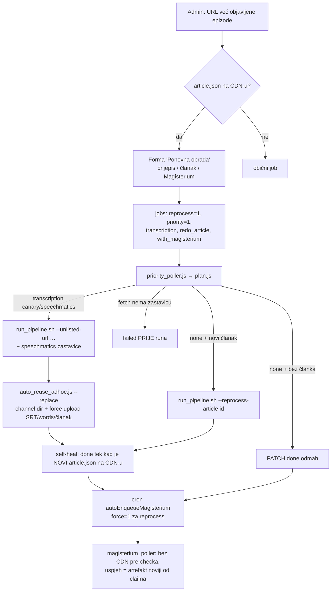

# Ponovna obrada već objavljene epizode + Speechmatics za prioritetne jobove

Stanje: 08.10.2026., pipeline **v0.17.0** (`cacdb2e`), fetch `aeea2bed`, D1 migracije
`0011_transcription` + `0012_reprocess` primijenjene na remote.

## Cilj

Iz `/admin` staru, već objavljenu epizodu podići na razinu nove (prijepis + words.json,
članak, Magisterium) bez Claude Code sesije, s istim rezultatom kao ručni rad iz
`fetch.domovina.tv`. Usput: prioritetni put daje isto što i nightly (Speechmatics +
Gemini sluh, a ne samo Canary).

## Povod: ponovna obrada `6e1MW97dv10` (job `34741663…`)

| Simptom | Uzrok | Popravak |
|---|---|---|
| Job nastao s `priority=0` | potvrdna stranica „već objavljeno" nije nosila `priority` | stranica je sada forma „Ponovna obrada", nosi sve izbore |
| `done` 17 s nakon claima | self-heal je vjerovao bilo kojem `article.json` na CDN-u, a stari je bio tamo od ožujka | `isFreshFor`: CDN `Last-Modified` ≥ `claimed_at` (inače `created_at`); isto u `bridge/reconcile.js` |
| datoteke `…_https_www_youtube_com_watch_v_…` | naslov joba je bio URL, a pipeline imenuje datoteke po `--unlisted-title` | `cleanTitle` (server) + `autocomplete="off"`; **izvor nije nađen** — oEmbed prefill upisuje samo pravi naslov |
| prioritetni run bez `words.json`, „magisterij MAI" | poller je slao samo Modal Canary + pyannote | `jobs.transcription`, default `speechmatics` → `--with-speechmatics --gemini-refine-promote` |
| CDN: novi `words.json`, stari `diarized.srt` | `data/*` je immutable, upload preskoči SRT | **otvoreno — fetch strana** (`--replace`, dolje) |

## Tok

## Odluke

- **Jedan stupac `transcription`** (`speechmatics` | `canary` | `none`), a ne poseban
  `transcribe_mode`. `none` je dopušten samo uz `reprocess=1`. Migracija 0011 ima
  `DEFAULT 'canary'` da stari reci ostanu istiniti; default za nove jobove (`speechmatics`)
  postavlja `createJob`. Ne miješati s `transcribe_backend` (to je lease `colab`|`modal`).
- **Novi prijepis uvijek povlači novi članak.** Poglavlja, vremena i citati starog članka
  ne odgovaraju novom tekstu. „Ne diraj članak" postoji samo uz „ne diraj prijepis".
- **Ponovna obrada je uvijek prioritetna.** Samo single-video run poštuje izbore po videu;
  nightly batch ima jednu globalnu konfiguraciju.
- **Magisterium bez novog stupca:** `with_magisterium` je namjera, a `reprocess=1` znači
  force. Cron za reprocess gleda samo zahtjeve nastale nakon joba (`m.created_at >= j.created_at`),
  inače bi ga stari zahtjev iz ožujka zauvijek blokirao.
- **/api/v1 cijena:** prioritet + Speechmatics = 5 kredita, prioritet + Canary = 3, standard 1.
  Default je Speechmatics, pa je `tier=priority` bez izbora transkripcije **poskupio s 3 na 5**.
  Upgrade „Forsiraj sada" naplaćuje razliku do cijene za transkripciju joba.
- **Feature detection umjesto pretpostavke:** `priority_poller.js` grepa izvor fetch
  skripti (`'--replace'`, `"--reprocess-article"`) i bez njih stavlja job u `failed`
  PRIJE runa. Inače bi plaćeni Speechmatics run prošao i tiho ostavio stari CDN.

## Ugovor prema fetch.domovina.tv

> **Implementirano 09.10.2026.** — fetch `8168977f` + `08b4de5c`, bridge `b71b7d2`. Vidi
> poglavlje „Dopuna 09.10." dolje. Izvorna specifikacija ostaje radi konteksta.

Specifikacija je u zaglavlju `bridge/plan.js`. Ukratko:

1. `auto_reuse_adhoc.js --video-id X --replace` — kad kanal već ima obradu: artefakte iz
   `_unlisted` kopiraj pod **pravim** channel basenameom (ne URL-imenom), stare preimenuj u
   `.bak` (nikad delete), reindex, pa force upload `diarized.srt` + `words.json` +
   `article`/`summary`/`outline` s purgeom. **SRT i words.json na CDN-u nikad iz različitih
   prolaza** — Flutter `speaker_timeline.dart` `withWordTimings` uparuje po početku cue-a
   (±1 ms) i traži točan broj riječi, a kad se to ne poklapa, namjerno ne ističe riječi.
   `force_upload.js --targets` danas ne zna `words`.
2. `run_pipeline.sh --reprocess-article <id> [--gemini-backend X]` — koraci 7+8 nad
   postojećim prijepisom, gdje god epizoda živi, + force upload.
3. Magisterium runbook (`docs/MAGISTERIUM_MCP_RUN.md`) dobiva `--force` u promptu. Mora
   regenerirati iako artefakt postoji i na kraju pokrenuti `force_upload.js --targets magisterium`.

## Zamke

- **Redoslijed deploya:** `COLS` u `db.ts` čita nove stupce, pa Worker deployan prije
  migracije ruši SVAKI upit. Zato uvijek prvo `wrangler d1 migrations apply --remote`, pa deploy.
- **Koraci 2.7/2.8 nisu bili ograničeni na video.** U prioritetnom ticku bi Speechmatics
  (~$0.80/h zvuka) platio i do 5 drugih svježih WAV-ova iz cijelog `storage/output`.
  Popravljeno u fetchu (`aeea2bed`): `PRIORITY_SCOPE_ARGS` i `--fresh-days 0` u fast-pathu.
- **Promocija u 2.8 nikad ne pregazi postojeći `.wav.canary.diarized.srt`.** Ako ga `_unlisted`
  već ima iz ranijeg runa (kao `6e1MW97dv10`), Speechmatics se plati, a kanonski SRT ostane
  stari. Rješava fetch strana (`--force-promote` za reprocess ili čišćenje `_unlisted` → `.bak`).
- `bridge/*.js` su live bez deploya ([[bridge-skripte-su-live]] u memoriji): svaku datoteku
  piši jednim zapisom, a nova pomoćna datoteka (`plan.js`) mora postojati prije pollera koji je `require`-a.

## Otvoreno

- E2E na `6e1MW97dv10` po kriterijima iz handoffa `2026-10-08-2345` (Speechmatics + Opus +
  Magisterium + Prioritet → CDN `diarized.srt` sadrži „Magisterium AI", isticanje riječi radi
  na `/v/6e1MW97dv10/t/127`, Magisterium noviji od članka, channel dir s `.bak`).
- Forma „Ponovna obrada" nije vizualno provjerena u browseru (`docs/UI.md`); pokrivena je
  samo testom generiranog HTML-a.
- Izvor naslova-URL-a nije nađen.
- Ako job u modu „samo članak" nikad ne dobije novi `article.json`, ostaje u `processing`
  (nema sweepa).

## Dopuna 09.10.: treća zastavica `--reprocess`

Fetch sesija je ustanovila da `--replace` nije dovoljan, jer je pipeline idempotentan po
postojanju izvedenih fajlova. Kad se ponovna obrada pokrene nad `_unlisted` koji već ima
staru obradu, KORAK 2.8 ne promovira novi Speechmatics SRT (stari `.wav.canary.diarized.srt`
postoji), a koraci 7+8 preskoče postojeći sažetak i članak. Run bi „prošao", a ne bi ništa
promijenio. Zato:

- `run_pipeline.sh --reprocess` (samo uz `--modal-only`): prije runa
  `tools/reprocess_episode.js stash` skloni staru izvedenu obradu u `.reprocess_bak/`
  (rename, nikad delete; od `08b4de5c` i done cacheove koraka 7/8/9). Nakon KORAKA 12 ide
  KORAK 12.1: prisilni prepis immutable CDN ključeva (diarized + words + članak + epub).
  `force_upload.js` preskače target bez lokalnog fajla, pa neuspjela transkripcija CDN ostavlja staru.
- `plan.js` šalje `--reprocess` za reprocess jobove s prijepisom; poller ga traži kao
  `"--reprocess"` u izvoru.
- **Zamka s navodnicima:** prva verzija pollera tražila je `'--replace'` (jednostruki
  navodnici), a `auto_reuse_adhoc.js` koristi dvostruke. Detekcija ne bi nikad prošla,
  pa bi svaka ponovna obrada išla u `failed`. Tokeni u `priority_poller.js` moraju
  doslovno odgovarati izvoru.
- **Magisterium `--force`** ne treba izmjenu runbooka: poller preskače pre-check, a
  `upload_to_r2.js` prepisuje `article.magisterium.json` kad se veličina promijeni
  (`REPAIRABLE_BASENAMES`) i radi purge.

## Testovi

- `cd backend && npm test`: esbuild bundla `test/*.test.ts`, pa `node --test`. Lažni D1
  bilježi SQL, a `fetch` je mockan.
- `npm test` u rootu: `bridge/plan.test.js` (mapiranje izbor → zastavice).

## Vezani dokumenti

- `bridge/plan.js` — ugovor prema fetch strani
- `docs/UI.md` — UI konvencije admina
- `../fetch.domovina.tv/docs/2026-10-06-words-json-titlovi.md` — words.json
